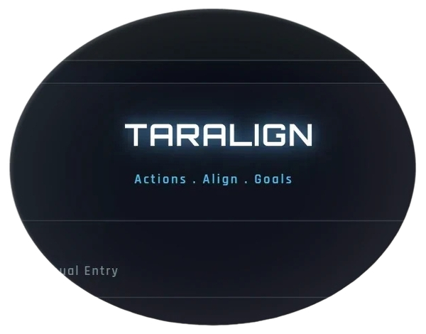

  

  

 

<pre align="left" style="width: 80%; border: 1px solid #2C5364; border-radius: 10px;">
<code class="language-python">
class Harshal_Jadhav:
    def __init__(self):
        self.name = "Harshal Jadhav"
        self.role = "AI & DS Engineer"
        self.focus = ["Machine Learning", "Deep Learning", "Predictive Modeling"]
        self.drive = "Infinite"

    def current_status(self):
        while self.drive:
            self.learn("Data Strutures & Algorithm")
            self.build("Scalable AI Systems")
            self.optimize("Neural Architectures")

# Executing core modules...
me = Harshal_Jadhav()
</code>
</pre>

<h3 align="center">
    <samp>&gt; Accessing_Tech_Stack...</samp>
</h3>

  
  &nbsp;
  
  &nbsp;
  
   
  
  
  &nbsp;
  
  &nbsp;
  
   

  
  &nbsp;
  
  &nbsp;
  
   
  
  
  &nbsp;
  
  &nbsp;
  

 

<h3 align="center">
  <samp>&gt; Deploying_Project_Modules...</samp>
</h3>

  
  &nbsp;&nbsp;&nbsp;&nbsp;
  

  

 

<h3 align="center">
  <samp>&gt; Accessing_Visual_Data_Logs...</samp>
</h3>

  <table>
    <tr>
      <td align="center" style="border: none;">
        
      </td>
      <td width="20"></td> <td align="center" style="border: none;">
        
      </td>
    </tr>
  </table>

  

